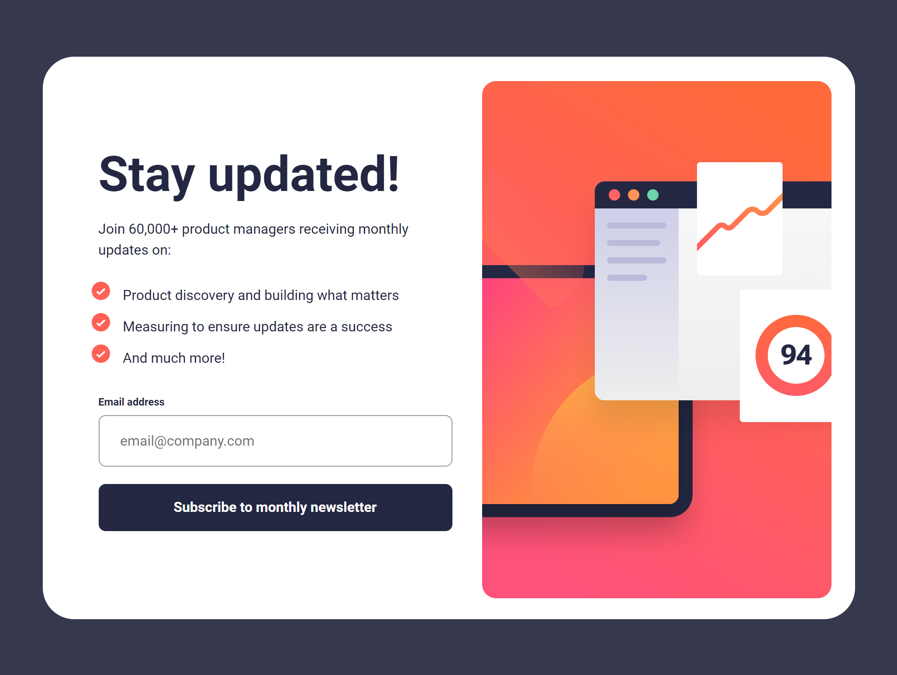

# Frontend Mentor - Newsletter sign-up form with success message solution

This is a solution to the [Newsletter sign-up form with success message challenge on Frontend Mentor](https://www.frontendmentor.io/challenges/newsletter-signup-form-with-success-message-3FC1AZbNrv). Frontend Mentor challenges help you improve your coding skills by building realistic projects. 

## Table of contents

- [Overview](#overview)
  - [The challenge](#the-challenge)
  - [Screenshot](#screenshot)
  - [Links](#links)
- [My process](#my-process)
  - [Built with](#built-with)
  - [What I learned](#what-i-learned)
- [Author](#author)

## Overview

### The challenge

Users should be able to:

- See hover and focus states for all interactive elements on the page

### Screenshot

### Links

- Solution URL: [https://github.com/ijohnst/fe-mentor-newsletter-signup](https://github.com/ijohnst/fe-mentor-newsletter-signup)
- Live Site URL: [https://ijohnst.github.io/fe-mentor-newsletter-signup/](https://ijohnst.github.io/fe-mentor-newsletter-signup/)

## My process

### Built with

- Semantic HTML5 markup
- CSS custom properties
- CSS Grid
- Mobile-first workflow
- Javascript

### What I learned
Getting the JS right to have validation and to DOM manipulate to add dynamic data

## Author

- Website - [Professional Portfolio](https://ianjdigital.com)
- Frontend Mentor - [@ijohnst](https://www.frontendmentor.io/profile/ijohnst)
